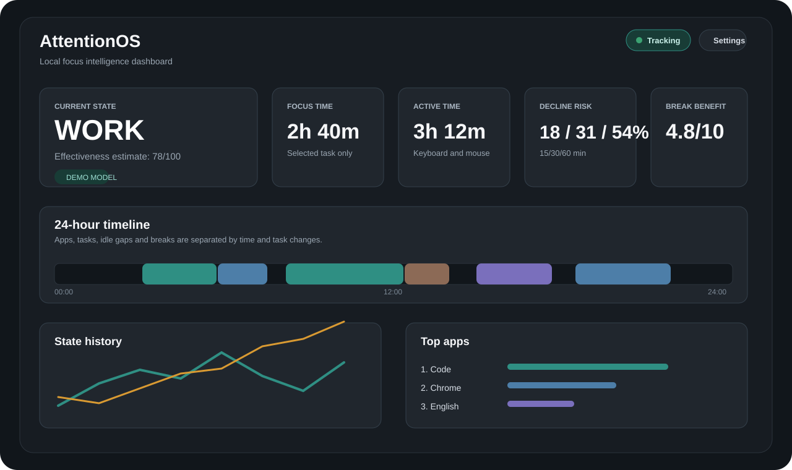
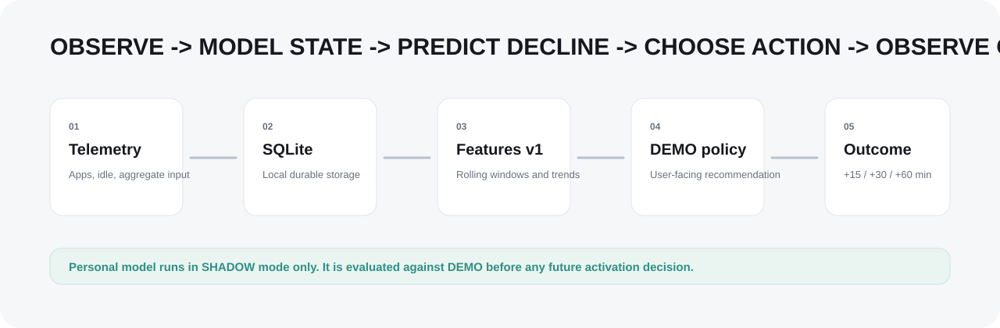
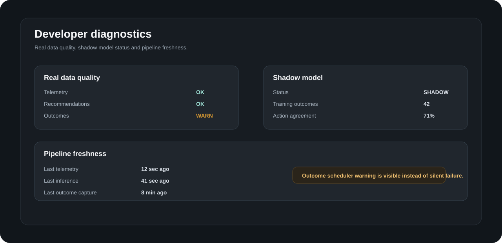
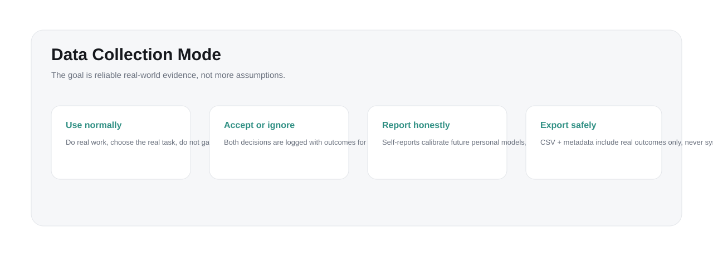

# AttentionOS

Privacy-first desktop focus intelligence for Windows.

AttentionOS is a local-first Windows application that collects behavioral telemetry,
models the current work state, recommends work or break actions, and captures the
outcomes needed to build a future personal productivity model.

It is not a Pomodoro timer. It is not a cloud tracker. It is a data collection and
decision-support system designed around one person's real work history.



## Product Loop

```text
telemetry -> SQLite -> feature engineering -> DEMO inference
          -> recommendation -> accepted / ignored
          -> break lifecycle -> outcomes +15/+30/+60
          -> self-report -> personal shadow dataset
```



## What It Tracks

AttentionOS records behavioral telemetry only:

- foreground application process;
- optional privacy-safe window title hash;
- selected task/category;
- idle time;
- aggregate keyboard event counts;
- aggregate mouse event counts;
- foreground app switches;
- task switches;
- recommendation and break outcomes.

AttentionOS does not record:

- typed text;
- raw keystrokes;
- clipboard;
- screenshots;
- microphone;
- camera;
- document contents.

All data is stored locally in SQLite at:

```text
%LOCALAPPDATA%\AttentionOS\attentionos.db
```

## Current Desktop App

The active desktop shell is built with Tauri + React and uses the existing Python
collector and ML pipeline.

Current user-facing capabilities:

- start/stop local telemetry collection;
- choose the current task/category;
- view a 24-hour local timeline with app, task, idle and break segments;
- inspect top apps and aggregated work blocks;
- receive DEMO ML work/break recommendations;
- start, ignore, complete and restore breaks;
- capture outcomes at +15, +30 and +60 minutes;
- save self-reports with effectiveness, fatigue and difficulty;
- export local data and real ML datasets;
- inspect data quality and model diagnostics.



## Reliability Pass

AttentionOS 0.5.0 is prepared for several weeks of real data collection.

The current reliability layer includes:

- SQLite schema versioning;
- fixed `FEATURE_SCHEMA_VERSION = v1`;
- restart-safe pending outcome capture;
- restart-safe break lifecycle restoration;
- duplicate outcome prevention;
- outcome validity labels;
- stale telemetry detection;
- daily health checks;
- structured runtime logging with rotation;
- backup creation before destructive actions and personal training;
- diagnostics for telemetry, inference, outcomes and self-reports;
- real-only ML dataset export with metadata.

Outcome rows are marked with quality:

```text
VALID
TASK_CHANGED
TRACKING_STOPPED
LONG_IDLE
INSUFFICIENT_DATA
```

Only `VALID` outcomes are counted as usable personalization samples.

## Personal Model Shadow Mode

The personal model is intentionally not allowed to control user-facing
recommendations in this version.

Stages:

```text
< 30 usable outcomes   -> COLLECTING
>= 30 usable outcomes  -> SHADOW
>= 50 usable outcomes  -> EXPERIMENTAL
>= 100 usable outcomes -> ELIGIBLE only if chronological validation beats DEMO
```

The DEMO model remains the production recommendation policy. The personal model
runs in shadow mode for diagnostics and comparison only.

Diagnostics show:

- shadow status;
- training outcome count;
- DEMO MAE;
- personal MAE;
- action agreement;
- personal-better and DEMO-better counts;
- data quality warnings.



## Real-world Data Collection

Use AttentionOS normally. The goal is honest longitudinal data, not forced
fatigue or artificial test behavior.

1. Use the computer as usual.
2. Select the real current task.
3. Do not try to trick or help the model.
4. If a recommendation seems useful, accept it.
5. If you disagree, press Ignore.
6. Fill self-reports honestly or Skip.
7. Do not edit the SQLite database manually.
8. Do not treat DEMO predictions as scientifically validated.

This phase is about data quality. Future model decisions should be based on real
outcomes, not assumptions.

## ML Dataset Export

The app can export a real-only ML dataset:

```text
attentionos_ml_dataset_YYYYMMDD_HHMMSS.csv
attentionos_ml_dataset_YYYYMMDD_HHMMSS.metadata.json
```

The export includes:

- timestamps;
- task/category;
- DEMO prediction fields;
- recommendation action;
- accepted/ignored flags;
- planned and actual break duration;
- outcomes +15/+30/+60;
- outcome quality;
- self-report fields when available;
- feature schema version;
- model versions.

Synthetic demo rows are never included in the real ML export.

## Architecture

```text
src/attentionos/
  collector/      Windows foreground, idle and aggregate input collector
  storage/        SQLModel entities, SQLite access and migrations
  settings/       Runtime preferences
  localization/   English/Russian resources
  sessions/       Derived activity and focus sessions
  features/       Rolling feature engineering
  ml/             Demo inference, real datasets and personal shadow utilities
  interventions/  Recommendation records and outcomes

attentionos-tauri/
  src/            React dashboard and settings
  src-tauri/      Tauri shell, SQLite diagnostics, schedulers and tray
```

## Build

Python environment:

```powershell
python -m pip install -e ".[dev,build,ml]"
python -m pytest
```

Tauri shell:

```powershell
npm --prefix .\attentionos-tauri install
npm --prefix .\attentionos-tauri run build
cargo test --manifest-path .\attentionos-tauri\src-tauri\Cargo.toml
npm --prefix .\attentionos-tauri run tauri build
```

Windows native builds require Rust and Visual Studio Build Tools with the
Desktop development with C++ workload.

Build artifacts are created under:

```text
attentionos-tauri/src-tauri/target/release/
```

## GitHub CI

The Windows workflow installs the Python package with ML dependencies, runs the
test suite, builds the Windows executable and uploads the EXE artifact.

```text
.github/workflows/windows.yml
```

## Development Status

AttentionOS is now in DATA COLLECTION MODE.

No new product features should be added until enough real outcomes exist to
evaluate the personal model honestly.

## License

MIT
